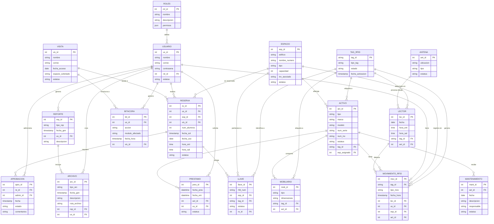

# 📊 Diagrama Entidad-Relación - SIGRAT (Base de Datos Oficial - 18 Tablas)

Este diagrama representa la estructura de las 18 tablas oficiales utilizadas en el sistema SIGRAT, incluyendo todas las relaciones y claves foráneas.

## Arquitectura de 18 Tablas
1. **Identidad y Accesos:** `ROLES`, `USUARIO`, `VISITA`.
2. **Hardware y Seguimiento:** `TAG_RFID`, `ANTENA`, `LECTOR`, `MOVIMIENTO_RFID`.
3. **Logística y Espacios:** `ESPACIO`, `RESERVA`, `APROBACION`.
4. **Inventario Físico:** `ACTIVO`, `LLAVE`, `MOBILIARIO`, `PRESTAMO`, `MANTENIMIENTO`.
5. **Auditoría:** `BITACORA`, `REPORTE`, `ARCHIVO`.
